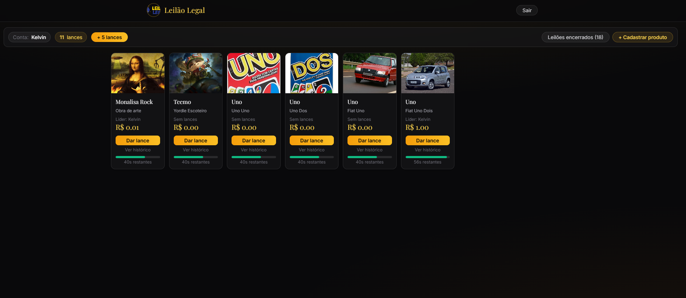

# Leilão Legal

Projeto 4 da matéria **Arquitetura e Tecnologias de Sistemas Web (DCC704)**.

Sistema de leilão online em tempo real: usuários dão lances em itens e veem o valor, o último lance e o tempo restante atualizarem instantaneamente para todos os participantes conectados, via WebSocket.



## Stack

- **Frontend**: Next.js 14 (App Router), React, TypeScript, TailwindCSS
- **Realtime**: Socket.io (cliente) + Socket.io + Express (servidor, em `backend/`)
- **Autenticação**: NextAuth.js (Credentials — e-mail/senha com hash via `bcryptjs`), sessão JWT
- **Dados**: SQLite via Prisma — um banco na raiz (`prisma/`) para usuários/autenticação e outro em `backend/prisma/` para itens e histórico de lances; ambos persistem entre reinícios do servidor
- **Validação**: payloads das rotas de API e dos eventos de socket (`bid`, `add_item`) validados com `zod` antes de tocar no banco
- **Conexão do socket protegida**: o frontend só conecta ao servidor Socket.io depois de logado, usando um token JWT de curta duração emitido por `/api/socket-token` e verificado pelo backend no handshake — conexões sem token são rejeitadas

## Funcionalidades

- Lances em tempo real com timer visual (barra de progresso, fica vermelha nos últimos 10s)
- Histórico completo de lances por item (usuário, valor e horário de cada lance)
- Notificação (toast) quando você é superado em um item, e quando um lance é rejeitado (rate limit ou item já encerrado)
- Tela de "leilões encerrados" com o valor final e o vencedor de cada item
- Rate limiting no backend: no mínimo 400ms entre lances do mesmo usuário, mesmo em itens diferentes
- Grid responsivo (2 colunas no mobile até 8 no desktop) e loading states dedicados para sessão, conexão do socket e carregamento dos itens

## Como rodar

O projeto tem **dois processos separados** que precisam rodar ao mesmo tempo: o frontend Next.js e o servidor Socket.io.

### 1. Configurar variáveis de ambiente

```bash
# na raiz do projeto
cp .env.example .env

# em backend/
cd backend
cp .env.example .env
```

Gere valores para `NEXTAUTH_SECRET` (raiz) e para `SOCKET_JWT_SECRET` (**precisa ser idêntico** nos dois `.env`, raiz e `backend/`):

```bash
openssl rand -base64 32
```

### 2. Backend (servidor Socket.io — porta 3000)

```bash
cd backend
npm install
npx prisma migrate dev   # cria o banco SQLite local (backend/prisma/dev.db)
npm run db:seed          # popula com os itens de exemplo (backend/data.json)
npm run dev
```

### 3. Frontend (Next.js — porta 3001)

Em outro terminal, na raiz do projeto:

```bash
npm install
npx prisma migrate dev   # cria o banco de usuários (prisma/dev.db)
npm run dev
```

Acesse [http://localhost:3001](http://localhost:3001) e cadastre uma conta (e-mail/senha) pela própria tela de login.

## Variáveis de ambiente

| Local | Variável | Descrição |
|---|---|---|
| `.env` (raiz) | `NEXT_PUBLIC_SOCKET_URL` | URL do servidor Socket.io consumida pelo frontend |
| `.env` (raiz) | `DATABASE_URL` | Conexão do Prisma com o banco SQLite de usuários |
| `.env` (raiz) | `NEXTAUTH_URL` | URL pública do frontend, exigida pelo NextAuth |
| `.env` (raiz) | `NEXTAUTH_SECRET` | Segredo usado pelo NextAuth para assinar sessão/JWT |
| `.env` (raiz) | `SOCKET_JWT_SECRET` | Segredo para assinar o token do socket — **idêntico** ao de `backend/.env` |
| `backend/.env` | `PORT` | Porta em que o servidor Socket.io escuta |
| `backend/.env` | `CORS_ORIGIN` | Origem (URL do frontend) liberada no CORS do servidor |
| `backend/.env` | `DATABASE_URL` | Conexão do Prisma com o banco SQLite de itens/lances |
| `backend/.env` | `SOCKET_JWT_SECRET` | Segredo para validar o token do socket — **idêntico** ao da raiz |

## Estrutura

```
app/                # páginas, rotas de API e entrypoint Next.js (App Router)
  api/auth/          # NextAuth (login via credentials)
  api/register/      # cadastro de novo usuário
  api/socket-token/  # emite o JWT usado para autenticar a conexão do socket
lib/                # cliente Prisma e configuração do NextAuth (frontend)
prisma/             # schema, migrations do banco de usuários (autenticação)
components/         # componentes React (Header, Grid, Login, AddProduct, DashBoard, Footer,
                    #   BidHistory, Winners, Toast)
backend/            # servidor Socket.io
  lib/              # acesso a dados (Prisma), validação (zod) e regras do leilão
  prisma/           # schema, migrations e seed do banco de itens/lances
```

## Autor

Kelvin Araújo Ferreira ([@DilliKel](https://github.com/DilliKel))

## Licença

[MIT](./LICENSE)
